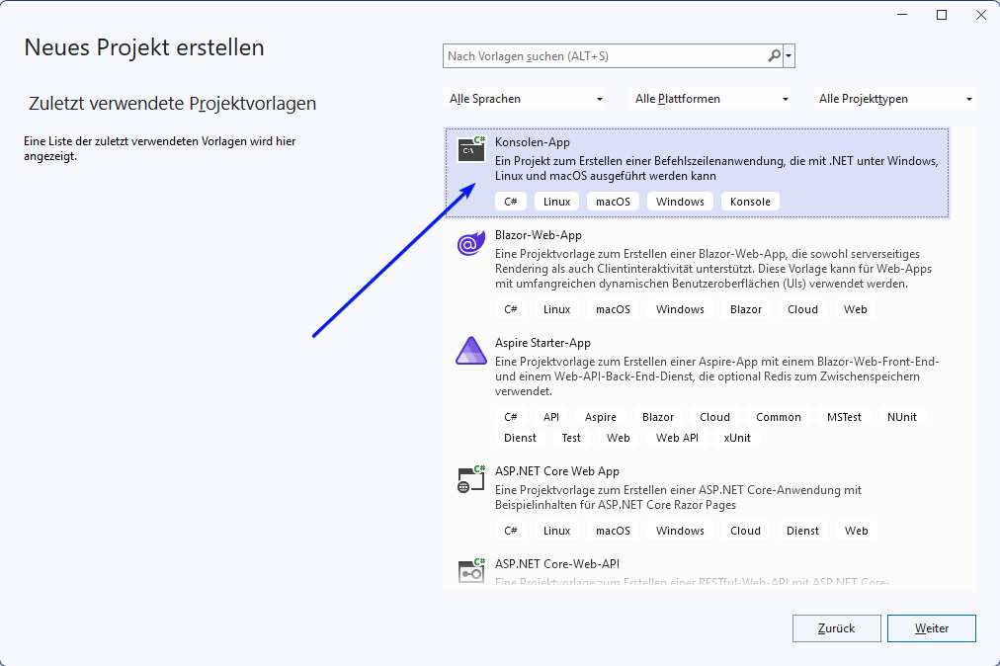
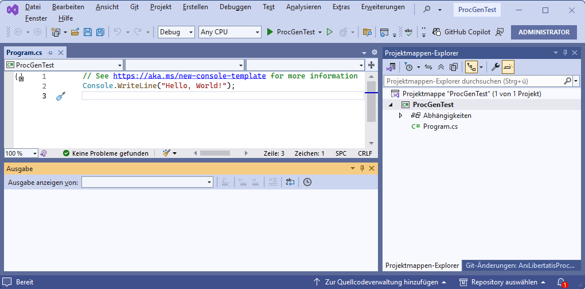
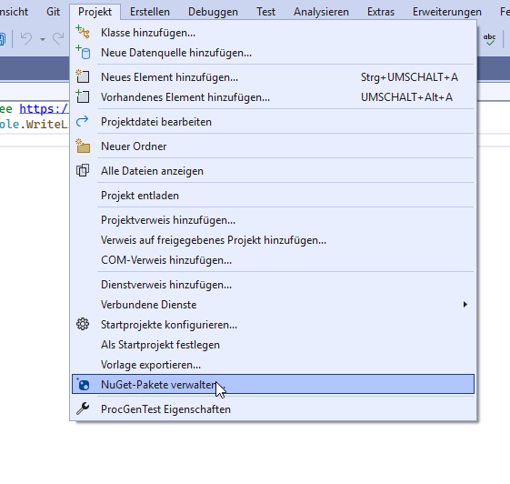
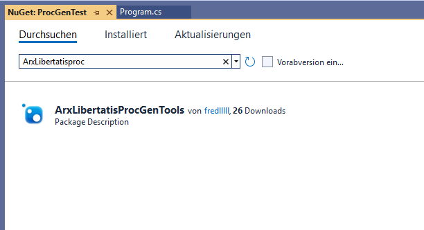
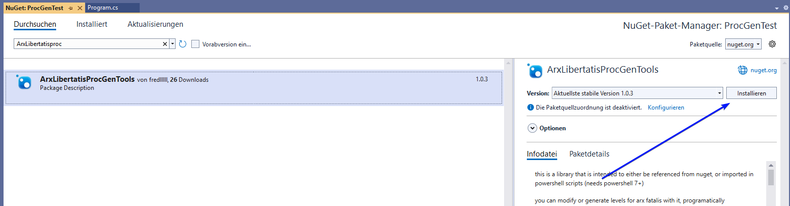

# Tutorial: Getting Started in Visual Studio

This guide walks you through creating a simple project in **Visual Studio**, installing the required library, and running a small example program. No prior programming experience needed!

---

## 1. Install Visual Studio

Download the free **Visual Studio Community Edition**:

👉 https://visualstudio.microsoft.com/vs/community/

---

## 2. Create a New Console Application

1. Open Visual Studio  
2. Select **Create a new project**  
3. Choose **Console App**

  


---

## 3. Install the Required Library (NuGet)

1. Right-click your project or use the project menu up top
2. Select **Manage NuGet Packages**



3. Search for **ArxLibertatisProcGenTools**  
4. Install it

  


---

## 4. Add the Example Code

Open **Program.cs**, delete everything inside, and paste in the following code:

```cs
using ArxLibertatisProcGenTools;
using ArxLibertatisProcGenTools.Generators.Mesh;
using ArxLibertatisProcGenTools.Generators.Plane;
using ArxLibertatisProcGenTools.Generators.Texture;
using ArxLibertatisProcGenTools.Modifiers;
using ArxLibertatisProcGenTools.Shapes;
using ArxLibertatisProcGenTools.Values;
using System.Numerics;
using Csg;

//this is a c# program using top level statements. its functionally equivalent to a Program class with a static void Main(string[] args)

//set the directory where we will save/load levels from. its the directory of where the arx.exe is
ScriptFunc.SetDataDir("F:\\Program Files\\Arx Libertatis");

//generate a flat floor
var floor = new FloorGenerator(); //we use so called "Mesh generators" to generate terrain meshes from data. this one just makes a plane with roughly 100x100 sized segments
floor.Size = new Vector2(5000, 5000); //make it this size
floor.Center = new Vector3(6000, -100, 6000); // and center around this position
floor.TextureGenerator = new SingleTexture("graph\\obj3d\\textures\\[soil]_human_standard2.jpg"); //textures come from a texture generator, in this case a single texture is enough
ScriptFunc.Apply(floor); //generators applied using the apply function

//add more polygons in a certain area (needed so next step looks better)
var enhance = new DetailEnhancer(); //this is a "Modifier", that will modify any mesh in the specified shape
var shape = new Sphere(); //shapes can be a sphere or a cuboid or anything else that you can program
shape.Radius = 500; //radius of 500 units
shape.Falloff = 0; //dont need falloff for a selection shape
enhance.Shape = shape;
ScriptFunc.Apply(enhance); //modifiers are also applied using the apply function

//apply a noise effect to the floor
var rumble = new Rumble(); //this modifier moves vertices around
var noise = new SimplexNoiseValue(); //we want simplex noise for this, instead of completely random noise
noise.Noise.Frequency = 0.002; //set the simplex noise parameters
noise.Noise.OctaveCount = 2;
rumble.NoiseValue = noise;
rumble.Magnitude = 100;

shape = new Sphere(); //shape with radius 2000, and falloff 1000, meaning effect will be applied fully from 0-1500, then fall off from 1500-2500
shape.Center = new Vector3(6000, 0, 6000);
shape.Radius = 2000;
shape.Falloff = 1000;

//you can also multiply shapes, which generates a new shape that is the result of the two
//in this case we want to scale the x and z axis by 0.1 while keeping the y axis. this is so the effect is mostly pronounced in the up and down direction
rumble.Shape = shape.MultiplyWith(new FixedVector(new Vector3(0.1f, 1, 0.1f)));
ScriptFunc.Apply(rumble);

//add a light, these are part of the EditorIO library and can be added directly to the level instance that ScriptFunc is keeping in memory
var light = new ArxLibertatisEditorIO.WellDoneIO.Light();
light.position = new Vector3(6000, -400, 6000);
light.color = new ArxLibertatisEditorIO.Util.Color(1, 0.7f, 0.7f);
light.fallStart = 100;
light.fallEnd = 1000;
light.intensity = 1;
ScriptFunc.Level.lights.Add(light);

//adding a CSG mesh, see the https://github.com/talanc/DotNetCsg library for usage
//create a rod that we will use to cut holes into a base shape
//intersect a cube with a sphere to get a cube with somewhwat rounded edges
//then get the difference of said cube minus 3 instances of the rod, each aligned along a different axis
//keep numbers close to 0 to prevent running out of memory, so no solids in the 1000s, scale and position it in the generator
//for more detailed solids, you can use the CylinderOptions or SphereOptions overloads when creating them instead of the simple functions
var rod = Solids.Cylinder(0.5, 2, true);
var solid = Solids.Difference(
    Solids.Intersection(
        Solids.Cube(1.4, true),
        Solids.Sphere(1, true)
        ),
    Solids.Union(
        rod,
        rod.RotateX(90),
        rod.RotateZ(90)
        )
    );
var csg = new CSGGenerator(); //this mesh generator generates a mesh from a CSG solid of the DotNetCsg library
csg.CsgSolid = solid;
csg.PositionOffset = new Vector3(6500, -150, 6000);
csg.Scale = new Vector3(100, 100, 100); //csg does not work well at the scale arx requires, so just scale and position it afterwards
// polytype glow will make the resulting mesh always visible at 100% brightess
csg.PolyType = ArxLibertatisEditorIO.Util.PolyType.GLOW;
csg.TextureGenerator = floor.TextureGenerator; //use the same texture generator as we used for the floor
ScriptFunc.Apply(csg); //again its applied using the apply function

//set lighting profile to danae. use autocomplete to see other options (GI does not work at the moment)
ScriptFunc.SetLightingProfile(ArxLibertatisLightingCalculatorLib.LightingProfile.Danae);

// set the position that the player spawns in
ScriptFunc.SetPlayerStart(new Vector3(6000, -500, 6000));

ScriptFunc.SaveLevel("level1"); // saves/overwrites level one, will do lighting calculation during save
//if for some reason you want to skip calculation of lighting at save, you can use ScriptFunc.SkipLighting and set it to true
```

To run the program, press **F5** in Visual Studio.

---

## 5. Exploring Further

Visual Studio’s **autocomplete** helps you discover other:

- generators  
- modifiers  
- shapes  
- available settings  

You can also check this repo’s PowerShell documentation for an overview of all available types and members.
